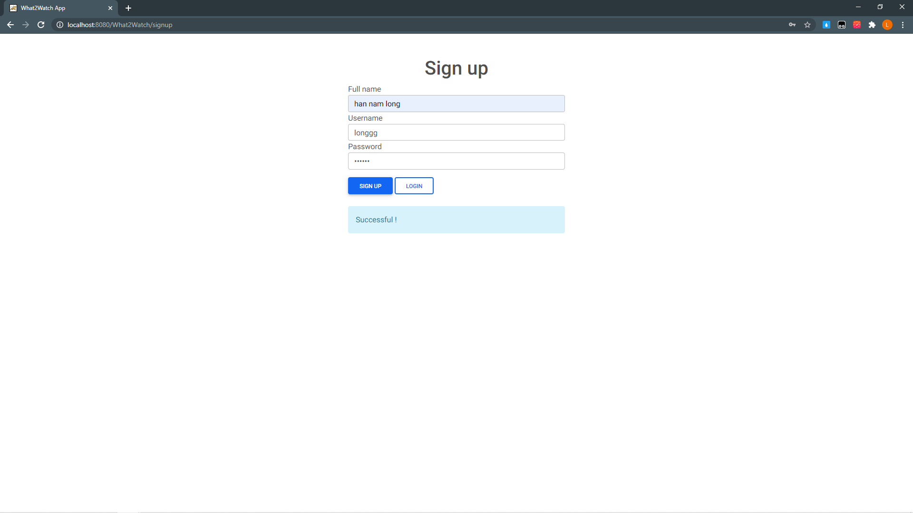

# What2Watch

What2Watch là ứng dụng web tìm kiếm phim. 

# Giới thiệu tính năng

  - Hiển thị cập nhật thông tin giới thiệu về những bộ phim mới và nổi tiếng nhất trên thế giới dựa trên đánh giá của [TMDb](https://www.themoviedb.org)
  - Tìm kiếm phim bằng tiêu đề
  - Với người dùng có tài khoản có thêm tính năng Like và Unlike 
  
# Các công nghệ sử dụng

  - [TMDb](https://www.themoviedb.org) - cung cấp dũ liệu phim
  - JSP, Servlet - quản lý trang web
  - MySQL - quản lý cơ sở dữ liệu người dùng
  - [Bootstrap](https://getbootstrap.com) - thiết kế giao diện
  - [jQuery](https://jquery.com/), AJAX - xử lí dữ liệu mà không cần reload trang
  
# Sử dụng
  ## 1. Tạo và cấu hình local sql server
    Thiết kế DB
      create database w2w;
      
      use w2w;
      go;
      create table users(
        `id` int(3) NOT NULL AUTO_INCREMENT,
        `fullname` varchar(250) NOT NULL,
        `username` varchar(250) NOT NULL UNIQUE,
        `password` varchar(6) NOT NULL,
        PRIMARY KEY (`id`)
      )
      go;
      
      create table likeMovies(
	      `userId` int(3) NOT NULL,
        `movieId` int NOT NULL,
        primary key (`userId`, `movieId`),
        foreign key (`userId`) references users(`id`)
      )
      go;
      
  ## 2. Sử dụng tính năng 

	Trang chủ

	
	Tìm kiếm

	
	Đăng ký, đăng nhập

	Quay lại trang chủ vả sử dụng tính năng like 

	
	Vào trang cá nhân và unlike

# Cảm ơn vì đã theo dõi

	
 
